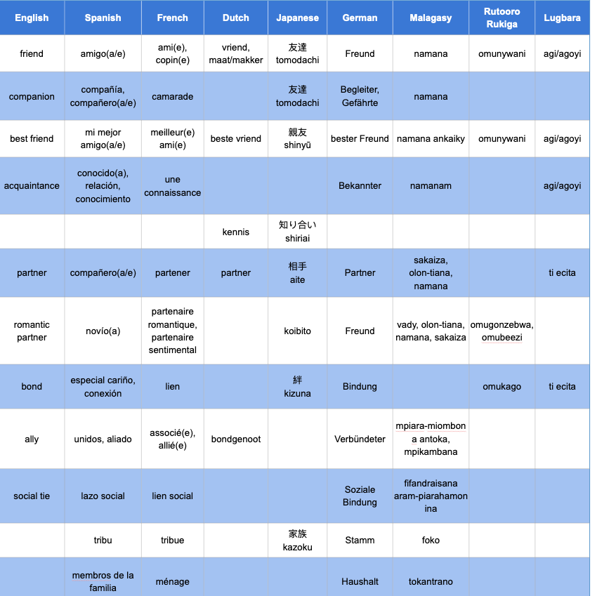

<h4>Noah W.  Stetson (1,2), Ian A. M. Barry (1,2), Isabelle R. Clark (1), Riley N. Derby (1),  Gabrielle L. Bueno (1),  Eliette Noromalala (1), Sam Rettke (1), David A. Rodelas Tokun Haga (1,3), Aaron A. Sandel (1)</h4>
 <i>1. Department of Anthropology, 2. College of Liberal Arts, 3. College of Natural Sciences, University of Texas at Austin</i>

 <h3>Abstract</h3>

“Friendship” is regularly used to describe relationships in primates. Is this appropriate? Twenty years ago, Joan Silk argued that it is, and she gave a careful definition of friendship that could be used across animals (Silk 2002, <i>Behaviour</i> 139:421-446). One problem Silk identified was that her definition relied on the English language and “Western” notions of friendship. Here we outline key words related to social relationships in several languages important in primatology. Discussions arose from a graduate seminar, “Ape Relationships,” taught at the University of Texas at Austin. We focus on languages in which primatologists often publish and present their findings (English, Spanish, French, Japanese, German, Dutch) and several languages common to the areas where we study primates (e.g. Madagascar and Uganda). We began with several English words: friend, best friend, social bond, and relationship. In brainstorming similar words in other languages, we added additional words and qualifiers in English, including companion, family, and acquaintance. Translating back and forth encouraged deeper reflection on the concepts underlying the words we used. Even within our class it was difficult to agree on the meaning of friendship. We conclude that it is not useful to apply the term to nonhuman animals. We may overlook important aspects of primate relationships by using a term such as friendship. We may also make it more difficult to communicate with our colleagues and collaborators who speak different languages. Only when we understand relationships in our own lives can we accurately describe relationships in other animals.

 <h3>Introduction</h3>

Understanding social relationships is an important focus in primatology, and “friendship” is regularly used as a shorthand. Washburn and DeVore (1961: 68) described preferential proximity and play relationships between baboons as friendships. Smuts (1985) famously described the special relationships between adult male and female baboons as friendship. Primates clearly have social “relationships,” defined as repeated interactions between individuals (Hinde). Such relationships may involve benefits for those involved (Kummer), as has been demonstrated in baboons (Silk 2007, Silk et al. 2010,), macaques (Schülke et al), and chimpanzees (Bray, Feldblum). But can we consider some of the relationships as "friendship?"

Two decades ago, Silk (2002) discussed the possible value and implications of using “friendship,” or the “F” word,  to describe some non-human primate relationships. Many primatologists, Silk noted, had avoided the term in their scholarly writing, seemingly in an attempt to avoid anthropomorphism. Others had embraced the term to reflect the potential similarities between human and non-human social relationships. Silk (2002) considered friendship an appropriate term to apply to other animals, and she provided an operational definition. Friendship, according to Silk (2002: 434) is characterized by (a) frequent associations and affiliative interactions (often, but not necessarily, including grooming); (b) coalitionary aggression, particularly in defense of one another; (c) mutual responsibility for maintaining proximity; (d) high degrees of reciprocity in nonaggressive activities such as grooming and food sharing; (e) high degrees of tolerance (such as co-feeding); (f) low degrees of stress when together; and (g) that the relationship endures across time and context. Silk (2002) also suggested that the term “friendship” should be reserved for relationships between non-relatives.

In the twenty years since Silk’s (2002) paper, there has been a proliferation of research on social relationships in primates and other animals, including the importance of social relationships for health, survival, and reproduction (Silk 2007; Silk et al. 2010). In those papers, relationships or “social bonds” (two terms which are often used interchangeably), include those formed between genetic relatives as well as unrelated pairs.

Friendship continues to crop up as a term, although it is rarely defined. Several scholars have reviewed the prevalence and function of relationships, sometimes using the term friendship (Seyfarth and Cheney 2012; Brent et al. 2013). Others have synthesized and discussed the meaning and importance of social bonds or friendship in humans and other primates (Dunbar). No one since Silk (2002), however, has provided a clear operational definition of friendship that could be applied to other animals. We return to this definition, and focus on a weakness that Silk identified: her analysis and definition was based on English and “Western” notions of friendship.

Here we outline key words related to social relationships in several languages important in primatology. Discussions arose from a graduate seminar, “Ape Relationships,” taught at the University of Texas at Austin. We focus on six languages in which primatologists often publish and present their findings (English, Japanese, French, Spanish, Dutch, and German), and several languages common to the areas where we study primates (e.g. Uganda and Madagascar). We also highlight relevant words or concepts from other languages with which we are familiar.

By defining words in different languages and cultural contexts, we seek to clarify the meaning and significance of such relationships in humans. Once such terms are clear to us, and appropriately capture the relationships present in our lives, we can then apply them to nonhuman animals. In this process, we follow in the steps of Hinde and Silk who saw value in drawing from our own experiences. But doing so requires careful reflection of our own lives, and a diversity of perspectives.

 <h3>Friendship and other relevant words</h3>

We compiled a list of words in English related to social relationships. Beginning with "friendship," we then included an exhaustive list of relationship terms adjacent to friends, family, romance, and community commonly used in our everyday lives. We then created comparable lists in different languages that we, our co-authors, and our colleagues speak as first or second languages. In some cases, translating back into English led us to add additional relevant words in English. In other cases, there was no English word. Our results are presented in Table 1.

 

 <i>Table 1. Key terms related to social relationships across languages in which primatologists discuss social relationships in nonhuman primates. Blank cells indicate that certain terms are not translatable.</i>

 
Translation proved a useful tool for deconstructing some of the terms. We began with friend, best friend, social bond, lover, and relationship. In brainstorming similar words in Spanish, French, Malagasy, and Japanese, we added several words and qualifiers in English, including companion, immediate family, and acquaintance.

 <h3>The human notion of friendship</h3>

The term friendship has different cultural and linguistic implications and contexts for different people. When we use the term “friend”, everyone is reading that with a different context, with different ideas of how they personally understand what a “friend” is, because it is a human-centric term and it’s impossible to be objective about. Even within an individual the term “friend” can have multiple meanings depending on the exact nature of the relationship that is described. In scientific writing and discussion it is better to use terms that are agreed upon and used less flexibly to minimize confusion.

 <h3>What gets lost in translation?</h3>

Relationships are important for both humans and non-human animals. As humans, we are particularly attuned to the importance of relationships when they are absent from our lives. Loneliness is a public health crisis (Gupta 2020). It is not just about being connected, but feeling connected. But there is not a clear antidote and antonym to loneliness. Is it friendship? Companionship? Connection? Community? In some ways, a true friend may not be necessary to ameliorate loneliness. The simple presence of an acquaintance might suffice. Or, sometimes we can feel lonely even in the presence of friends. (Does that mean we are experiencing something different than loneliness such as sadness or depression?) A beloved pet, such as a dog or cat, may mitigate loneliness. Is our dog our friend? Or are dogs more often “companions” rather than friends? And what about time alone in nature? Sometimes that can reduce feelings of loneliness.

The English term “friendship” is somewhat inflexible in circumstances such as these. Other languages better describe relationships that are interspecific and/or transcend time and space. The Scottish Gaelic term <i>dùthchas</i>, for instance, refers to both tangible and intangible heritage. It integrates Scottish Highlanders, Islanders, and their descendants into a network of land and tradition with an emphasis on individual heredity rooted in historical experiences. <i>Dùthchas</i> once referred to a more visible system of social organization that has since been uprooted by English conquest. Today it is a broad, temporally and spatially sound conceptualization of relationships between humans, nonhuman animals, and land. <i>Dùthchas</i> perpetuates a sense of kinship and belonging in spite of diaspora.

Likewise, Lugbara speakers use various terms that connote relationships often overlooked by the quintessentially Western (specifically English) denotations of “friendship.” Lugbara does not have a direct equivalent for the English term “friend.” Instead, there are several terms that can be used to characterize different types of relationships. <i>Agoyi</i> refers to a broad spectrum of relationships, ranging from acquaintanceships to close bonds. Although <i>agoyi</i> is contextually close to how “friend” is used to describe relationships among English speakers, other terms such as <i>okposi</i> indicate relationships that are not necessarily analogous to “friendship.” <i>Okposi</i> can be translated as “a strong hold.” A close relative can have a strong hold over someone close to them. Lugbara also sheds light on broader linguistic possibilities when it comes to describing interspecific relationships. A bond with one’s pet cat, for instance, can be deemed <i>alata</i>, or “inseparable.” Such a relationship can be recognized by humans as one of the most important relationships in their lives, as is the case for one us. The definition of “friendship” proffered by Silk overlooks the possibility of interspecific relationships such as these.

For some of us, our mother was also our best friend, although the word for best friend may be rarely equated with mothers in general. For example, <i>namana</i> describes friends and companions in Malagasy. It means “the presence of someone next to you.” Mothers and fathers are not necessarily <i>namana</i>, although they could be (if your parent is or even could be considered your “friend”). <i>Namana</i> is also a feeling that connects you to others.
 

Thus, the term “friendship” is inherently limited by its cultural exclusivity. It is important to consider the culturally specific connotations such a word carries. Although Silk acknowledges that her “description of the properties of friendship is based mainly on subjects in Western societies,” no mechanism is proposed to mediate the bearing that these influences will have on interpretations of its use as a concept in primatological literature. “Friendship” is loaded with Western cultural baggage that smooths over the nuance of relationships portrayed uniquely in other languages. Intercultural dialogue breathes life into the field of primatology. The use of the word “friendship” overlooks culturally relevant distinctions between different types of relationships.

 <h3>“Lemurs don’t have namana”</h3>

Utilizing translations provides further insight to the intricacies of relationships between individuals. Our colleague who was raised speaking Malagasy and has studied lemurs notes that <i>namana</i> could be applied to the relationships of some primates such as chimpanzees, but probably not lemurs.

 Through discussions with researchers at Ngogo Chimpanzee Project, we found that some words in Rutooro and Rukiga better encapsulate the relationships between certain chimpanzees. Some chimpanzee pairs have <i>obuzare</i>; they are kin (often brothers) with multiple things in common. Other chimpanzees have <i>omukago</i> based on the time they spend grooming and waiting for each other. In some cases, <i>omukago</i> describes something beyond what is encompassed by the English term "friendship" because the support they offer each other can be unlimited. In Rutooro, our colleagues describe a building relationship as <i>omuganzano</i>, a term that is applicable to chimpanzees as well as humans.

What are the defining characteristics of a friendship between non-human primates? Inconsistent definitions throughout the literature pull from Silk (2002) but do not necessarily have every feature of her definition. Additionally, the type of friendships described often have varying levels of affiliation for seemingly different purposes. For example, friendships have been described between male and female baboons that lead to mating opportunities. Young adult chimpanzees have been found to have preferential friendships with their fathers (Sandel 2020). The relationship between young adult males and their fathers in chimpanzees appears to be more of a ‘mentor-mentee’ friendship. The differing relationships that have been described show how insufficient the term "friendship" is in describing the relationship between individuals.

It is easy to anthropomorphize animals to create an illusion of understanding how they feel — one way to do this is to subjectively apply the term "friendship" to animals. However, interrogating this intuition will help us develop new metrics for accurately defining relationships across primates.

 <h3>Discussion: "Friendship" in other primates?</h3>

We have expanded on Silk’s (2002) useful and thought-provoking discussion of friendship. Given our varied understanding of friendship, we conclude that it is not useful to apply the term to nonhuman animals. Although our objective is not to be comprehensive or definitive in our findings, even our small sample of co-authors reveals that the meaning of "friendship" is so diverse that applying it to nonhuman primate relationships is a hindrance to our cross-cultural understanding of our own publications. This also creates myriad problems as we seek to understand nonhuman relationships.
"Friendship" may not be an ideal term to describe close relationships with family members or individuals where there is a large age gap. "Friendship" is a relatively narrow category of social relationship. We suggest that people instead use "relationship" and specify the nature of that relationship when studying other primates.

We also see a need for a clear definition of social bonds and relationships that connects to our personal and cross-cultural understanding of relationships with operational definitions that can be applied across species. In this regard, a cross-cultural perspective is key. In our discussion of friendship, for example, we found that some languages do not limit relationships to two individuals. By looking only at one-on-one interactions, we may miss important aspects of relationships, and looking at wider social networks may also overlook the importance of small clusters, such as triads.

 <h3>Conclusion</h3>

Friendship is a blunt tool for analyzing the complexities of relationships. We may be missing important aspects of primate behavior and relationships by using a term such as friendship, which is so variably understood. Indeed, we may also make it more difficult to communicate and collaborate if our colleagues and collaborators from different cultures have trouble making sense of the words we use. Only when we understand relationships in our own lives can we accurately describe relationships in other animals.

 <h3>Acknowledgements</h3>
<i>We thank Kamugyisha Brian, Diana Kanweri, Asianazu Blessing, Kalunga Davis, Silvy van Kuijk, Bas van Boekholt, Michael Zeosky, Sofian Merabet, Yoko Clark, Ken Clark, and other generous collaborators for making this comparison of friendship across languages possible.</i>

